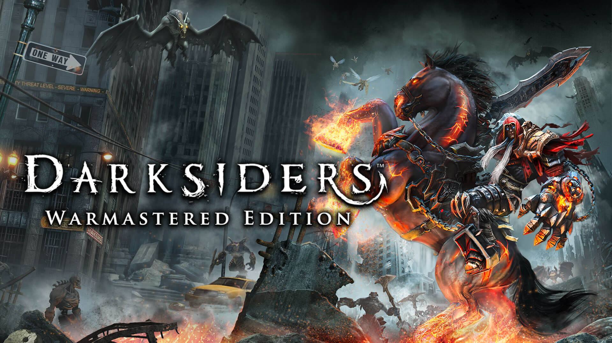

Darksiders
================

   War [#f1]_

Darksiders is published by THQ in 2010. It is a hack and slash,
action-adventure game. This review will involve some spoilers for the story, you
have been warned.

Story
----------

In the game you play as a nephilim and Horseman of the Apocalypse, War. You
find yourself on Earth in the middle of a war between angels, demons and mankind.
However, mankind doesn't last long and is quickly wiped out. In the ensuing battle
you are killed and find yourself before a council of ancient beings who charge
you with upsetting the balance of the universe by preemptively starting The
Apocalypse. Believing yourself to be innocent you request to find the one
responsible for controlling and tricking you into starting the apocalypse. The
council agrees and revives you so that you may go on your quest. You travel
across Earth 100 years in the future and eventually you travel to more biblical
settings. Along the way you fight mostly demons and monstrosities with the
occasional angels.

To avoid the bigger spoilers that is all you need to know for now.

Gameplay Review
-----------------

Darksiders is one of the most challenging games I have played. While being a
hack and slash it does a good job of making you have to work to stay alive. Most
of the bigger fights in the game are extremely unforgiving,especially on your
first play through. When facing the bigger enemies, not the bosses, you can only
take a couple of hits before you have to use health potions to regain it back or
you die. On the topic of health potions, they are fairly rare and you don't come
across them often, at least not often enough to use them freely whenever you wish.
You can often find one or two before a bigger fight, but if you use them in that
fight and lose you don't get them back and now you have to do the fight even more
precisely than before.

Although it's not just the combat and lack of health of potions that make
this game challenging, it also boasts some incredibly clever and infuriating
puzzles. One of the big aspects of this game is the replayability and that is
very evident in its puzzles. From having to pull levers to get platforms in the
right order, to lining up lasers to open doors, and teleporting weights around
onto floating platforms that you have to hop around on, this game has it all
and so much more than what is listed. Not to mention, every boss fight has its
own mechanics that you have to use in order to win the fight. There are moments
in the fights that you hack and slash, but in order to get to those moments you
have to solve the puzzles while trying not to die.

With the limited resources, high damage fights, and consistently changing
and progressing puzzles this game makes an infuriating impression in all of the
right ways. It will have you red in the face as you continually die or you can't
solve the puzzle, but once you do, once you finally get it and you've advanced
it will feel so rewarding. Once you finally beat the game, if you played on easy,
you can earn the achievement "You Call This Easy?" to really give a reality
check.

.. [#f1] The Horseman War riding on Ruin. Photo by THQ Nordic for remastered
version of Darksiders in 2016.
