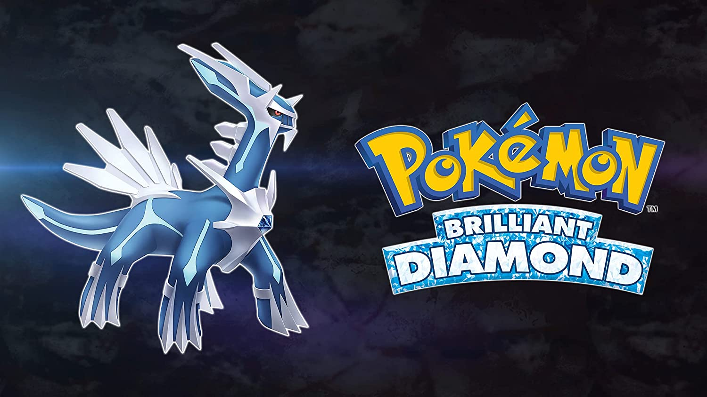

Pokemon Brilliant Diamond
===========================

Pokemon Brilliant Diamond is a remake of the 2006 game Pokemon Diamond which was
released for the original Nintendo DS. Rather than being developed by GameFreak
like previous remakes for the series, Brilliant Diamond and its counter part
Shining Pearl were developed by ILCA. This is caused by GameFreak working on
Pokemon Legends: Arceus. In terms of story it is faithful to its predecessor
and takes the player through the same path and plot.

Gameplay Review
----------------

The actual gameplay mechanics of this game are no different than any other
main series Pokemon entry. You get into a battle, have your four options, and
your four moves to choose from. Same old same old, if you expected anything
different from a Pokemon main series game you were kidding yourself.

What they do change is some slice of life things in the over world. Now your
entire team gains experience points from fights rather than just the pokemon/s
that were in the fight. You get to have a pokemon follow you around in the over
world. Hidden Moves were also brought back for this game but modified from how
they previously worked. Your pokemon no longer need to know the move for you to
be able to use it, it just exists on your Poketch as an app that you can cycle
through. The ability to not have to sacrifice a move slot for a mediocre move
is tremendous, and should you decided to teach the move to a pokemon you can get
rid of it once they level up like any other move.

The other big change to the game is The Grand Underground. Instead of just a
series of tunnels that you can look for items in, there are now rooms that have
catchable pokemon in them. This allows players the options to actually get a fire
type pokemon and not feel forced into choosing the fire starter Chimchar for that
reason alone. As early as you can enter the underground, Eternia City, you can
get a Houndoom, a fire/dark type pokemon that can greatly help you beat the grass
gym leader of the city.

Version Exclusive Pokemon
--------------------------

================== ===================
Brilliant Diamond  Shining Pearl
================== ===================
Caterpie            Weedle
Metapod             Kakuna
Butterfree          Beedrill
Ekans               Sandshrew
Arbok               Sandslash
Growlithe           Vulpix
Arcanine            Ninetales
Seel                Slowpoke
Dewgong             Slowbro
Scyther             Slowking
Scizor              Pinsir
Murkrow             Misdreavus
Honchkrow           Mismagius
Gligar              Teddiursa
Gliscor             Ursaring
Kecleon             Stantler
Elekid              Magby
Electabuzz          Magmar
Electivire          Magmortar
Larvitar            Bagon
Pupitar             Shelgon
Tyranitar           Salamence
Seedot              Lotad
Nuzleaf             Lombre
Shiftry             Ludicolo
Mawile              Sableye
Zangoose            Seviper
Solrock             Lunatone
Cranidos            Shieldon
Ramparados          Bastiodon
Stunky              Glameow
Skuntank            Purugly
Dialga              Palkia
Suicune             Articuno
Entei               Zapdos
Raikou              Moltres
================== ===================