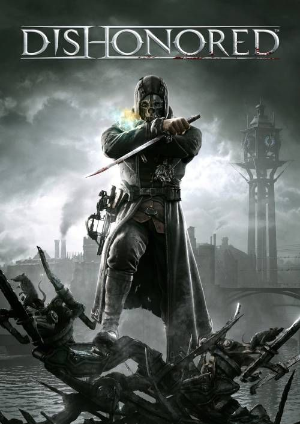

Dishonored
============

   Arkane Studios [#f2]_

Story
------
**Dishonored** is an action-based adventure game set in a fictional plague-ridden
steampunk-esque world. The city is modeled after London in the 1800s. You play as
Corvo Attano, a bodyguard to the Empress that rules over the city.
Unfortunately, at the beginning of the game assassins
descend on the empress and kill her. Even worse, you are blamed for the murder.
Corvo escapes and sets out on a dangerous mission to assassinate those who were
truly behind the murder of the empress. Corvo is visited by *The Outsider* who
grants him with his mark, giving him access to an array of useful supernatural
abilities.
These include:

* Blink (teleportation)
* Dark Vision
* Devouring Swarm (summon pack of rats)
* Possession
* Bending Time
* Windblast
* Vitality (more health)
* Shadow Killing (foes you kill will turn to ash)

Gameplay
---------
**Dishonored** is largely a stealth-based action game. Sneaking in and out of
places, silently killing your enemies with your blade, and not being detected
are usually the best way to go about your missions. However, it is only a
stealth game if you want it to be. Corvo has a gun and other abilities to make
non-stealth combat a reality. This will likely make the game more difficult,
however, because of the amount of damage your enemies do. Unlike other games,
**Dishonored** is very realistic with the amount of damage you are able to take.
For instance, one or two gunshots is likely enough to kill you.

In addition to the missions and combat that takes up a large part of the game,
there are also a wide array of collectibles for you to find throughout your
missions. The only downside to the gameplay is how short the story takes to get
through. Before purchasing this game, keep in mind that it is only a 9-12 hour
play-through.

Aside from this, the game gives you plenty of room and freedom to explore the
world at will. While the quests take on a more linear approach, you are free to
explore the city at will while on those quests. The freedom in combat-style and
character building is what I enjoy most about the game. You can buy the abilities
that you want and ignore the ones you don't. This game is a good example of
allowing the player freedom to do what they want, but also keeping a linear story
for cohesiveness.

.. [#f2] "Arkane Studios. (2012). Dishonored [Video game]. Bethesda.