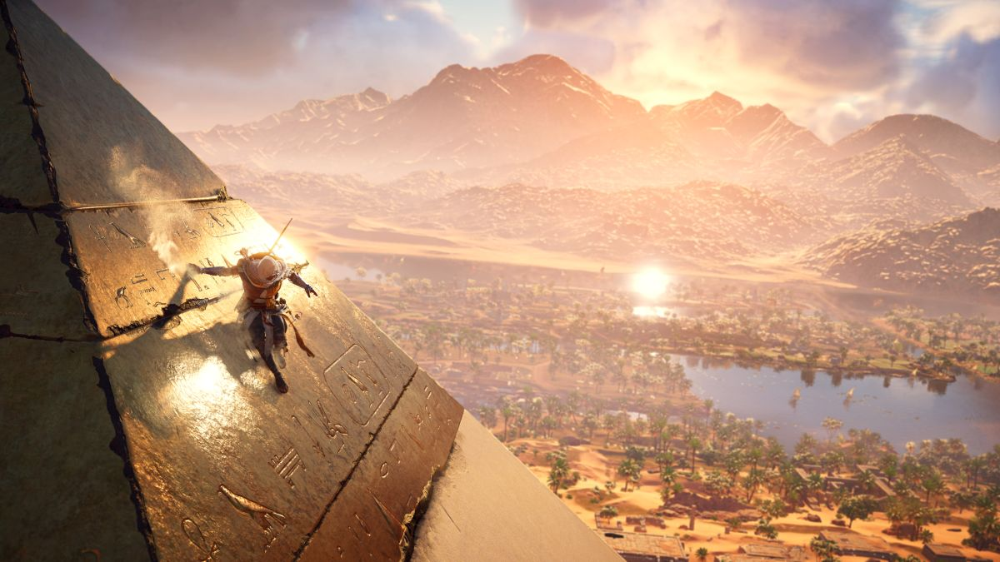

Assassin's Creed Origins Review
===============================
This review will cover 3 basic parts of the game. The :ref:`Storyline`, the
:ref:`Gameplay`, the :ref:`Graphics`.

.. _Storyline:

Basic Storyline
---------------
We will be trying to write this review without any **big** spoilers, however we
feel the need to point out that there may be a few *small* ones here and there
so if you are planning on playing this game and would like to discover the story
for yourself you may want to skip to the :ref:`Gameplay` section of this review.

This game is set in ancient Egypt where you play as a Medjay named Bayek from
Siwa. The pharaoh at the beginning of the story is Ptolemy XIII, him and other
powerful men in masks end up killing your son and so a year later the gameplay
starts. You are driven by revenge against those in masks who caused your son's
death. Meanwhile Cleopatra takes the throne of Egypt and continues a very
corrupt regime that causes the common people to suffer. While seeking revenge
you continue to help out the common people.

.. _Gameplay:

Gameplay
--------
The overall connectedness of this game is very obvious. Not only do many of the
quests go well together, but the map is also more connected than most AC games
that I have played. As you go through the quests it is never too hard to figure
out what you need to do even if it is a little bit harder to do it. Then for
those who really love puzzles they have plenty of papyri puzzles that you can
solve in order to get different hidden items.

Assassinations
^^^^^^^^^^^^^^
The combat is also pretty good overall. They have the sneaky option as always
but now you have a bow so you can be an even sneakier assassin killing your
enemies from a ways away without ever being seen. They also have tools in this
game to help you get away or mass assassinate people such as smoke bombs, fire
bombs, poisoned darts, and many other fun ones to try out during your play-
through.

Melee Combat
^^^^^^^^^^^^
The melee combat is very similar to the other AC games released around this
time. It is generally pretty smooth, however there are some really annoying
parts to it. If you are only level 10 and you find a level 15 enemy you won't be
able to kill him unless you grind away for like **10 minuets** of almost perfect
combat. This is because he will almost one-shot you while you do about 5 damage
per attack. This is slightly frustrating for me personally as it feels more
grindy for levels than some of their previous games.

.. _Graphics:

Graphics
--------
Overall The graphics are really well done in this game. If you're computer or
console can handle it then some of the viewpoints that are provided can be
really stunning seeing for miles in every direction.

   Kitten Photo

