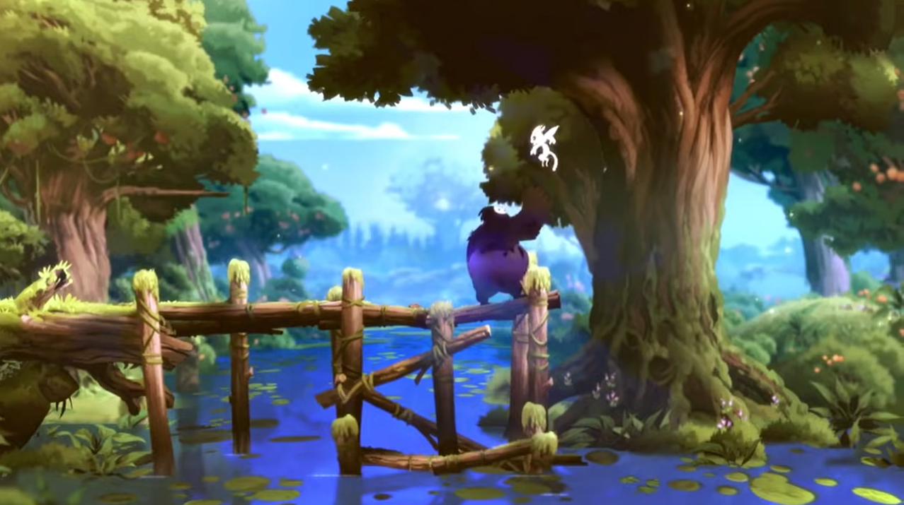

Ori and the Blind Forest
========================
This review will cover 3 basic parts of the game. The :ref:`Storyline Ori`, the
:ref:`Gameplay Ori`, the :ref:`Graphics Ori`.

Basic Summary of this Review (Out of 10)

=========  ========  ========  =======
Storyline  Gameplay  Graphics  Overall
=========  ========  ========  =======
10/10      9/10      8/10      9/10
=========  ========  ========  =======

.. note::
   This review rating is probably a little bit biased as the game is made by an
   indie company and not a big name company. It is also shorter so there is a
   lot less time for it to not meet expectations.

.. _Storyline Ori:

Basic Storyline
---------------
We will be trying to write this review without any **big** spoilers, however we
feel the need to point out that there may be a few *small* ones here and there
so if you are planning on playing this game and would like to discover the story
for yourself you may want to skip to the :ref:`Gameplay Ori` section of this review.

Important Characters
^^^^^^^^^^^^^^^^^^^^

* Nibel - Ori's Adoptive Parent
* Ori - Guardian of the Spirit Tree/Forest
* Sprit Tree - Life Giver of the Forest
* Kuro - A Giant Shadowy Owl, Hostile to Ori

In this story you are set in a magical land with intelligent animals and no
humans. The story is narrated by the Spirit Tree in the forest of Nibel, of
which Ori is a guardian. You play the game through as Ori who has recently lost
their guardian because of a cataclysmic event that makes the forest wither and
many starve. During this time Ori wanders through the forest and begins to find
out what is wrong with it and so they set out to restore the forest.

Going into much more detail will have big spoilers for the plot, however I found
the plot to be insanely good and enjoyable. I think this is probably also the
first plot that has ever made me tear up because it just absorbed me into it and
had a very bitter sweet and unexpected ending.

.. _Gameplay Ori:

Gameplay
--------
Ori and the Blind Forest is a platform game in which you are encouraged to
explore and search out the many secret items that they have put around the
world. These secret items will help you become stronger and have an easier time
exploring. There are also enemies which you will need to defeat while exploring
however unlike a lot of platform games that are based on exploring, the combat
in this game is still really enjoyable. It isn't overly frustrating because of
unresponsive controls, but it can still be somewhat challenging at times. There
are also of course different difficulty settings which is really nice for those
who are story players and those who need the harder combat.

.. _Graphics Ori:

Graphics
--------
For being a smaller indie game especially the graphics in this game are quite
amazing. It definitely isn't a huge open world with every detail being really
nice. However everything in the game is really pretty in my opinion. Although
you aren't blown away by graphics it is a very relaxing aesthetically pleasing
type of graphics which actually fits really well with the type of game that it
is.

   Intro Story for Ori [#f1]_

Overall I would highly recommend this game as it is probably one of my favorites
of all time. I think that it has an amazing story with very pretty and fitting
graphics, and the combat keeps me engaged but didn't make me want to rage at the
game. So if you are a Dark Souls only type of gamer than this might not be the
game for you, otherwise you should definitely play this one!

.. [#f1] "`<Ori and his Caretaker <https://www.orithegame.com/blind-forest/>`_".
   Moon Studios. 2015. Retrieved 2021-12-07.